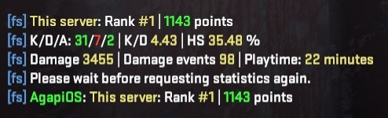
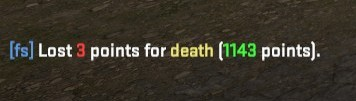

# cs2-finestats-lite

Standalone CS2 statistics for SwiftlyS2: **SQLite inside the plugin**, without a
website, HTTP listener, backend, Docker service or external database. Version 1.0.7.

Includes local player rankings, configurable scoring, bot/warmup filtering, combat
and session counters, weapon/hitgroup statistics, English colored chat messages,
public `!rank`/`rank`, private score/progress notices and optional offline country lookup.

## Screenshots

In-game examples. Point changes depend on your ranking configuration and player ratings.

**Player statistics and rank:** points, kills/deaths/assists, K/D ratio, headshot
percentage, damage, and playtime.



**Kill and MVP rewards:** chat notices for regular kills, headshots, and MVP awards.


**Death penalty:** points deducted and the updated total.



## Install

Requires SwiftlyS2 **1.4.10** and its .NET 10 runtime. Download/build the ZIP for your
OS (`linux-x64` or `win-x64`). Extract the included `finestats-lite` directory into
`addons/swiftlys2/plugins/`. Include **all** DLLs and the native SQLite library from
the ZIP; do not copy just the plugin DLL. Restart CS2 or load the plugin with SwiftlyS2.

The plugin creates its configuration at
`addons/swiftlys2/configs/plugins/finestats-lite/config.jsonc`, and its SQLite file at
`addons/swiftlys2/data/finestats-lite/finestats-lite.db` (the framework plugin data
directory). Keep this data directory outside plugin release replacements and make
it writable by the game-server account. No API key or connection string is needed.
Reload after changing configuration.

The full finestats plugin is independent. Disable its chat commands/score messages before using Lite on the
same game server: command names overlap. Existing registered commands are not taken
over, and running both collectors produces two independent sets of statistics.
For SwiftlyS2 1.4.9, build a compatibility package against that framework's assembly
using the command below. See [deployment](docs/DEPLOYMENT.md) for installation steps.

## Commands

`!rank` (also bare `rank`) and `!statsme` (also bare `statsme`) are public.
`PublicRankReplies` controls only `rank`; `statsme` replies are always public.
Other replies and errors are private.

| Command | Local result |
|---|---|
| `rank`, `skill`, `points`, `place` | Rank and points; aliases other than rank reply privately |
| `top5`, `top10`, `top20` `[page]` | Ranked players on this server |
| `next` | Up to three players immediately ahead of you |
| `statsme` | Public profile and combat counters |
| `kpd`, `kdratio`, `kdeath`, `kills`, `kill`, `player_kills` | Private profile and combat counters |
| `session`, `session_data` | Exact current collector/session counters and observed time |
| `weapons`, `weapon` `[page]` | Weapon kills, damage and separate fire/damage events |
| `targets`, `target` `[page]` | Hitgroup observations and percentages |
| `accuracy` | Explains why exact accuracy/misses cannot be inferred |
| `servers`, `status` | This local server and its recorded observations |
| `load` | Local profile; no cross-server aggregation |
| `hlx_help`, `hlx_menu` | Chat help |

SwiftlyS2's `sw_` console commands and configured chat prefixes also apply. Lists
accept page numbers, not weapon-name filters. Default cooldown: three seconds.

## Configuration and backups

All settings and all 72 message defaults are in [resources/config.jsonc](resources/config.jsonc).
See [configuration and storage](docs/CONFIGURATION.md) for options, backup/restore
and behavior. Example:

```json
"RankingProgressNotificationsEnabled": true,
"Messages": {
  "RankingProgress": "You still need [green]{remaining}[/] kills to start ranking ([yellow]{kills}[/]/[yellow]{required}[/])."
}
```

Kill point notices start with the kill that reaches `Ranking.MinimumKillsForLeaderboard`.
Before that, points are saved silently and ranking progress notices remain available.
Other score reasons are unaffected. Only counted kills advance qualification. `Ranking.ExcludeBots=false` includes bot
encounters for human counters and rating; bots use baseline strength and never gain
permanent ratings. The default excludes bots. Ranking changes affect future events.

## Country lookup (GeoIP)

Country lookup is optional and disabled by default. Download the **CSV** version
of [DB-IP Country Lite](https://db-ip.com/db/download/ip-to-country-lite).
The plugin supports `.csv` and compressed `.csv.gz` files; you do not need to
extract the gzip download. MaxMind GeoLite2 databases and `.mmdb` files are not
supported. No country database is included with the plugin.

1. Download the CSV database from the link above and retain its attribution and
   license information: **IP Geolocation by [DB-IP](https://db-ip.com)**.
2. Place the file in a persistent directory readable by the game-server account,
   outside the plugin release directory. You can rename it to
   `dbip-country-lite.csv.gz` to keep the configured path stable across updates.
3. Open `addons/swiftlys2/configs/plugins/finestats-lite/config.jsonc` and update
   the existing settings below. Merge these values into your configuration;
   do not replace the entire file or add duplicate keys.

   ```json
   {
     "GeoIpEnabled": true,
     "GeoIpCountryCsvPath": "/path/to/geoip/dbip-country-lite.csv.gz",
     "ConnectMessagesEnabled": true,
     "PublicConnectMessages": true,
     "ConnectCountryNames": true
   }
   ```

   Replace the example path with the **absolute path** on your server. On Windows,
   use a path such as `C:/CS2Data/geoip/dbip-country-lite.csv.gz`.
4. Reload the plugin or restart the server. The database loads in the background.
   Check the server log for loading warnings, then reconnect a player to check
   the country in the connection announcement. Players already connected when
   the plugin loads do not receive a new announcement.

`ConnectCountryNames=true` displays the English country name and code; set it to
`false` to display only the code. `PublicConnectMessages=false` makes the connection
announcement private. If no country can be resolved, the default text is
`Unknown country`. Player IP addresses are not stored in the statistics database.

The plugin does not download or update the country database automatically. To
update it, replace the file at the configured path and reload the plugin. To turn
lookup off, set `GeoIpEnabled` to `false` and reload. See the
[configuration guide](docs/CONFIGURATION.md#setting-up-country-lookup) for details.

## Build and test

For an introduction to the source code, read the [code guide](docs/CODE-GUIDE.md).

Build from the root of this repository with the .NET 10 SDK. Required collector,
event, helper and message code is included under `Shared/`; no sibling project is
needed. This repository contains only the Lite plugin and its tests/documentation.

```powershell
dotnet run --project tests/finestats-lite.Tests.csproj -c Release
dotnet publish finestats-lite.csproj -c Release -r linux-x64 --self-contained false
dotnet publish finestats-lite.csproj -c Release -r win-x64 --self-contained false
```

Output: `build/finestats-lite-linux-x64-swiftly1.4.10.zip` or `build/finestats-lite-win-x64-swiftly1.4.10.zip`.
The tests use temporary real SQLite databases. They do not connect to production.
Native game callbacks and chat appearance still require a CS2 smoke test.

## Scope

This release supports one server per database. It has no PostgreSQL import,
historical raw-event replay, web UI, HTTP service, centralized ranking or automatic
cross-server sync. Existing full-version data is not migrated. Unknown data stays
unknown; observed time is not exact connection time. An abrupt process crash can
lose events still in the bounded memory queue, but committed batches are atomic.

For an exact installed framework API compatibility build:

```powershell
dotnet publish finestats-lite.csproj -c Release -r linux-x64 --self-contained false -p:SwiftlyAssemblyPath=/absolute/path/SwiftlyS2.CS2.dll -p:PackageVariant=swiftly1.4.9
```

Only use the variant label matching the supplied assembly. See
[verification](docs/VERIFICATION.md) for test coverage and remaining native smoke checks.
